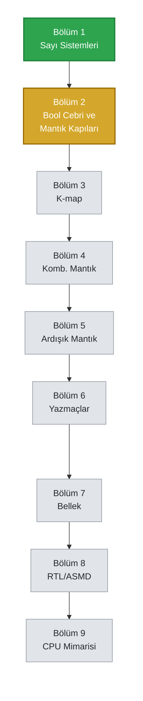

# Sıfırdan İşlemciye — Sayısal Donanım Tasarımı

**Yazarlar:** Şafak Şahin · Batuhan Hangün


Bool cebri ve temel mantık kapılarından başlayıp kombinasyonel ve ardışık mantık
devreleri üzerinden ilerleyen, sonlu durum makinelerine (FSM) ve basit bir CPU
mimarisine kadar uzanan, Türkçe yazılmış kapsamlı bir dijital donanım tasarımı kitabı.

Kitap; lisans/yüksek lisans öncesi teorik temeli sağlamlaştırmayı, gate-level tasarım
ile fiziksel gerçekleme (silikon/layout) arasındaki köprüyü tam olarak kavratmayı
hedefler. Her kavram yalnızca tanım düzeyinde bırakılmaz — sezgisi, "neden"i ve elle
doğrulanmış örnekleriyle birlikte, başka bir kaynağa ihtiyaç duyurmayacak derinlikte
işlenir.

## İlerleme Yolu



🟩 Tamamlandı &nbsp;&nbsp; 🟨 Devam Ediyor &nbsp;&nbsp; ⬜ Planlandı

<details>
<summary><b>Bölüm 2 — detaylı ilerleme</b></summary>
<br>

- [x] Giriş (tarihçe, ikili değişkenler, gerilim eşikleri)
- [x] Cebirsel Yapı Kavramı
- [x] Bool Cebirinin Aksiyomları
- [x] Düalite İlkesi ve Temel Teoremler
- [x] De Morgan Teoremi
- [ ] Sayısal Mantık Kapıları
- [ ] Bool Fonksiyonları
- [ ] Kanonik ve Standart Formlar
- [ ] Diğer Mantık İşlemleri
- [ ] Entegre Devreler

</details>

## Mevcut Durum

| # | Bölüm | Durum |
|---|-------|:---:|
| 1 | Sayı Sistemleri ve Kodlama | ✅ Tamamlandı |
| 2 | Bool Cebri ve Mantık Kapıları | 🟨 Devam ediyor |
| 3 | Kapı Seviyesinde Sadeleştirme (K-map) | ⬜ Planlandı |
| 4 | Kombinasyonel Mantık Devreleri | ⬜ Planlandı |
| 5 | Senkron Ardışık Mantık | ⬜ Planlandı |
| 6 | Yazmaçlar ve Sayaçlar | ⬜ Planlandı |
| 7 | Bellek ve Programlanabilir Mantık | ⬜ Planlandı |
| 8 | RTL, ASMD ve Kontrol Mantığı | ⬜ Planlandı |
| 9 | Basit Bir CPU Mimarisi | ⬜ Planlandı |

Bölüm 2'nin alt başlık bazında ilerlemesi için yukarıdaki açılır listeye bakabilirsin.

## Metodoloji

Öğrenilen her konsept dört ayrı sütundan geçirilir:

1. **Teori ve Dokümantasyon** — Bu depodaki LaTeX kitabı (Türkçe, profesyonel donanım
   kitabı formatında).
2. **Temel Simülasyon** — Logisim ile kapı seviyesinde görselleştirme.
3. **Sektörel Pratik** — Vivado/HDL ile üç modelleme türü (yapısal, veri akışı,
   davranışsal).
4. **Açık Kaynak ASIC Akışı** — Icarus/Verilator ile testbench, GTKWave ile dalga
   analizi, Yosys ile sentez, OpenLane/KLayout (SKY130 PDK) ile layout — testbench'ten
   GDSII'ye tam bir akış.

## Kullanılan Araçlar

| Sütun | Araç | |
|---|---|---|
| Dokümantasyon | XeLaTeX |  |
| Simülasyon | Logisim |  |
| HDL | Xilinx Vivado |  |
| Testbench | Icarus Verilog / Verilator |  |
| Dalga Analizi | GTKWave |  |
| Sentez | Yosys |  |
| Layout / ASIC | OpenLane · KLayout (SKY130) |  |

> Not: Bu araçların çoğu niş, açık kaynak EDA projeleri olduğu için hazır bir logo
> servisinde (shields.io/simple-icons) resmî ikonları bulunmuyor; rozetler bu yüzden
> düz renkli. Gerçek logo dosyalarını paylaşırsan (portrelerde yaptığımız gibi) buraya
> gömebilirim.

## Derleme

Kitap `latex/ana-kitap.tex` dosyasından, **XeLaTeX** ile derlenir (fontspec ve
unicode-math kullanıldığı için pdflatex ile derlenemez):

```
cd latex
xelatex ana-kitap.tex
```

Derlenmiş güncel PDF (`latex/ana-kitap.pdf`) da depoda takip edilmektedir.
