# Sıfırdan İşlemciye — Sayısal Donanım Tasarımı

**Yazarlar:** Şafak Şahin · Batuhan Hangün


Bool cebri ve temel mantık kapılarından başlayıp kombinasyonel ve ardışık mantık
devreleri üzerinden ilerleyen, sonlu durum makinelerine (FSM) ve basit bir CPU
mimarisine kadar uzanan, Türkçe yazılmış kapsamlı bir dijital donanım tasarımı kitabı.

Kitap; lisans/yüksek lisans öncesi teorik temeli sağlamlaştırmayı, gate-level tasarım
ile fiziksel gerçekleme (silikon/layout) arasındaki köprüyü tam olarak kavratmayı
hedefler. Her kavram yalnızca tanım düzeyinde bırakılmaz — sezgisi, "neden"i ve elle
doğrulanmış örnekleriyle birlikte, başka bir kaynağa ihtiyaç duyurmayacak derinlikte
işlenir.

## İlerleme Yolu

```mermaid
flowchart LR
    subgraph F1["Faz 1 — Temeller"]
        B1["Bölüm 1<br/>Sayı Sistemleri"]
        B2["Bölüm 2<br/>Bool Cebri"]
    end
    subgraph F2["Faz 2 — Kombinasyonel Mantık"]
        B3["Bölüm 3<br/>K-map"]
        B4["Bölüm 4<br/>Komb. Mantık"]
    end
    subgraph F3["Faz 3 — Ardışık Mantık"]
        B5["Bölüm 5<br/>Ardışık Mantık"]
        B6["Bölüm 6<br/>Yazmaçlar"]
    end
    subgraph F4["Faz 4 — Bellek"]
        B7["Bölüm 7<br/>Bellek"]
    end
    subgraph F5["Faz 5 — RTL"]
        B8["Bölüm 8<br/>RTL/ASMD"]
    end
    subgraph F6["Faz 6 — CPU"]
        B9["Bölüm 9<br/>CPU Mimarisi"]
    end

    B1 --> B2 --> B3 --> B4 --> B5 --> B6 --> B7 --> B8 --> B9

    class B1 done
    class B2 progress
    class B3,B4,B5,B6,B7,B8,B9 todo

    classDef done fill:#2ea44f,stroke:#1a7f37,color:#ffffff,stroke-width:2px
    classDef progress fill:#d4a72c,stroke:#9a6700,color:#ffffff,stroke-width:2px
    classDef todo fill:#e1e4e8,stroke:#8c959f,color:#24292f,stroke-width:1px
```



🟩 Tamamlandı &nbsp;&nbsp; 🟨 Devam Ediyor &nbsp;&nbsp; ⬜ Planlandı

<details>
<summary><b>Bölüm 2 — detaylı ilerleme</b></summary>
<br>

- [x] Giriş (tarihçe, ikili değişkenler, gerilim eşikleri)
- [x] Cebirsel Yapı Kavramı
- [x] Bool Cebirinin Aksiyomları
- [x] Düalite İlkesi ve Temel Teoremler
- [x] De Morgan Teoremi
- [ ] Sayısal Mantık Kapıları
- [ ] Bool Fonksiyonları
- [ ] Kanonik ve Standart Formlar
- [ ] Diğer Mantık İşlemleri
- [ ] Entegre Devreler

</details>

## Metodoloji

Öğrenilen her konsept dört ayrı sütundan geçirilir:

1. **Teori ve Dokümantasyon**  — Bu depodaki LaTeX kitabı (Türkçe, profesyonel donanım
   kitabı formatında).
2. **Temel Simülasyon**  — Logisim ile kapı seviyesinde görselleştirme.
3. **Sektörel Pratik**  — Vivado/HDL ile üç modelleme türü (yapısal, veri akışı,
   davranışsal).
4. **Açık Kaynak ASIC Akışı**    — testbench'ten (GTKWave)
   layout'a (SKY130 PDK) tam bir akış.

## Mevcut Durum

- **Bölüm 1 — Sayı Sistemleri ve Kodlama:** tamamlandı (sayı tabanları, ikili
  aritmetik, tümleyenler, işaretli sayılar, IEEE 754, BCD/Gray/ASCII/parity).
- **Bölüm 2 — Bool Cebri ve Mantık Kapıları:** devam ediyor (detaylar yukarıdaki
  açılır listede). Sırada: Sayısal Mantık Kapıları.
- Sonraki bölümler henüz başlamadı.

## Derleme

Kitap `latex/ana-kitap.tex` dosyasından, **XeLaTeX** ile derlenir (fontspec ve
unicode-math kullanıldığı için pdflatex ile derlenemez):

```
cd latex
xelatex ana-kitap.tex
```

Derlenmiş güncel PDF (`latex/ana-kitap.pdf`) da depoda takip edilmektedir.
