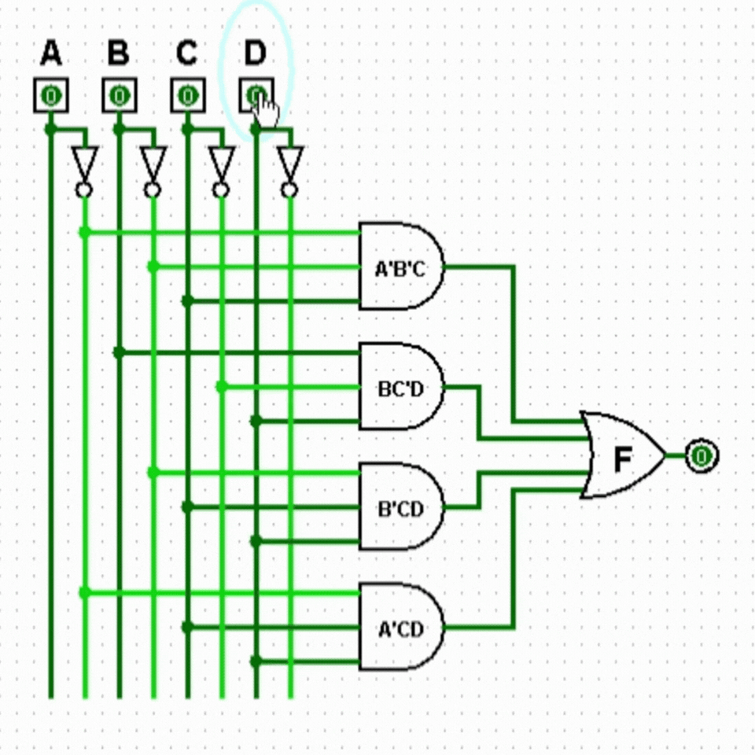

# Logisim Simülasyonları


Bu klasör, kitaptaki (bkz. ana repo [`README.md`](../README.md)) örneklerin **gerçek,
çalıştırılabilir Logisim devre dosyalarını** (`.circ`) içerir. Kitapta bir devre
[circuitikz](https://ctan.org/pkg/circuitikz) ile statik bir şema olarak çizilir; buradaki
dosyalar aynı devrenin Logisim'de kurulup simüle edilebilen, interaktif karşılığıdır.

## Logisim nedir, bu projede neden kullanılıyor?

**Logisim**, dijital mantık devrelerini kapı (gate) seviyesinde sürükle-bırak ile
tasarlayıp gerçek zamanlı simüle etmeye yarayan, eğitim amaçlı, açık kaynaklı bir
araçtır. Kapıları (AND/OR/NOT/...) sahaya yerleştirip birbirine bağlarsınız, giriş
pinlerine tıklayarak 0/1 değerini değiştirirsiniz ve çıkışın anında nasıl değiştiğini
görürsünüz. Devrenin kağıt üzerinde "doğru görünmesi" ile gerçekten doğru çalıştığını
görmek arasındaki farkı kapatır.

Bu, kitabın "Dört Sütunlu Metodoloji"sinin ikinci ayağıdır:

1. **Teori & Dokümantasyon** → LaTeX kitabı (bu repodaki `latex/` klasörü).
2. **Temel Simülasyon** → **Logisim** (bu klasör).
3. **Sektörel Pratik** → Vivado / HDL.
4. **Açık Kaynak ASIC Akışı** → Icarus/Yosys/OpenLane (WSL).

Yani her örnek şu sırayı izliyor: problem tanımı → doğruluk tablosu → K-map ile
sadeleştirme → circuitikz ile statik devre şeması (kitapta) → **aynı devrenin Logisim'de
kurulup simüle edilmesi (burada)**.

## Nereden indirilir / nasıl kurulur?

Bu dosyalar **klasik Logisim, sürüm 2.7.1** ile oluşturuldu (dosyaların içindeki
`<project source="2.7.1">` etiketinden anlaşılıyor). İki seçenek var:

- **Klasik Logisim** (orijinal, Carl Burch tarafından geliştirildi): <http://www.cburch.com/logisim/>
  Java Runtime Environment (JRE) gerektirir. JRE kuruluysa `.jar` dosyasını çift
  tıklamak yeterlidir. JRE eksikse buradan indirebilirsiniz: <https://www.java.com/en/download/>
- **Logisim-evolution** (klasik projenin hâlâ aktif geliştirilen topluluk forku, daha
  güncel arayüz ve özellikler sunar, klasik `.circ` dosyalarını da sorunsuz açar):
  <https://github.com/logisim-evolution/logisim-evolution>

Kurulduktan sonra bu klasördeki herhangi bir `.circ` dosyasını **File → Open** ile
açabilir, ya da dosya ilişkilendirmesi varsa doğrudan çift tıklayabilirsiniz.

## Nasıl kullanılır?

1. `.circ` dosyasını Logisim'de açın.
2. Soldaki giriş pinlerine (`A`, `B`, `C`, `D` gibi) tıklayarak değerlerini `0`/`1`
   arasında değiştirin.
3. Sağdaki çıkış pininin (`F`) değerin doğruluk tablosuyla eşleştiğini gözlemleyin.
   Bu, kitaptaki K-map sadeleştirmesinin gerçekten doğru olduğunun bağımsız bir
   doğrulamasıdır.

## Demo

Örnek 3.9 (Asal Sayı Dedektörü, $F=A'B'C+BC'D+B'CD+A'CD$) devresinin Logisim'de
simüle edilişi:



## Klasör yapısı

Her bölüm klasörü, kitaptaki alt bölüm numarasına göre ayrılır; her alt bölümün
içinde de "Örnek" ve "Alıştırma" kutuları ayrı klasörlere düşer:

```
logisim/
└── bolum03/
    ├── 3.5/
    │   └── ornekler/      → Bölüm 3.5'in "Örnek" kutularının devreleri
    ├── 3.6/
    │   ├── ornekler/      → Bölüm 3.6'nın "Örnek" kutularının devreleri
    │   └── alistirmalar/  → Bölüm 3.6'nın "Alıştırma" kutularının devreleri
    └── ...                → sonraki alt bölümler eklendikçe aynı düzende devam eder
```

## Mevcut dosyalar

### Bölüm 3.5: Sadeleştirmenin Donanım Karşılığı

| Dosya | Kitaptaki karşılığı | Sadeleştirilmiş fonksiyon |
|---|---|---|
| [`bolum03/3.5/ornekler/ornek-3.9-asal-sayi-detektoru.circ`](bolum03/3.5/ornekler/ornek-3.9-asal-sayi-detektoru.circ) | Örnek 3.9: Asal Sayı Dedektörü | $F=A'B'C+BC'D+B'CD+A'CD$ |
| [`bolum03/3.5/ornekler/ornek-3.10-uc-kisilik-oylama-sistemi.circ`](bolum03/3.5/ornekler/ornek-3.10-uc-kisilik-oylama-sistemi.circ) | Örnek 3.10: Üç Kişilik Oylama Sistemi | $F=xy+xz+yz$ |
| [`bolum03/3.5/ornekler/ornek-3.11-gecersiz-bcd-kodu-dedektoru.circ`](bolum03/3.5/ornekler/ornek-3.11-gecersiz-bcd-kodu-dedektoru.circ) | Örnek 3.11: Geçersiz BCD Kodu Dedektörü | $F=AB+AC$ |

### Bölüm 3.6: Toplamların Çarpımı Formunun K-map ile Bulunması

Bu dosyaların her biri **SOP ve POS gerçeklemesini bir arada** içerir (tek
Logisim tuvalinde iki devre).

| Dosya | Kitaptaki karşılığı | SOP | POS |
|---|---|---|---|
| [`bolum03/3.6/ornekler/ornek-3.12-endustriyel-kontrol-paneli.circ`](bolum03/3.6/ornekler/ornek-3.12-endustriyel-kontrol-paneli.circ) | Örnek 3.12: Endüstriyel Kontrol Paneli | $B'D'+B'C'+A'C'D$ | $(A'+B')(C'+D')(B'+D)$ |
| [`bolum03/3.6/ornekler/ornek-3.13-hata-kontrol-devresi.circ`](bolum03/3.6/ornekler/ornek-3.13-hata-kontrol-devresi.circ) | Örnek 3.13: Hata Kontrol Devresi | $BC'+BD'+AC'+AD'$ | $(A+B)(C'+D')$ |
| [`bolum03/3.6/alistirmalar/alistirma-3.8-akilli-kapi-kilidi.circ`](bolum03/3.6/alistirmalar/alistirma-3.8-akilli-kapi-kilidi.circ) | Alıştırma 3.8: Akıllı Kapı Kilidi | $A'C'+B'C'+A'D+B'D$ | $(A'+B')(C'+D)$ |
| [`bolum03/3.6/alistirmalar/alistirma-3.9-otomatik-bahce-sulama-vanasi.circ`](bolum03/3.6/alistirmalar/alistirma-3.9-otomatik-bahce-sulama-vanasi.circ) | Alıştırma 3.9: Otomatik Bahçe Sulama Vanası | $B'D+BD'+AB$ | $(B+D)(A+B'+D')$ |

Her dosyaya kitabın ilgili örneğinin/alıştırmasının devre şeklinin altındaki
dipnottan da ulaşılabilir.
